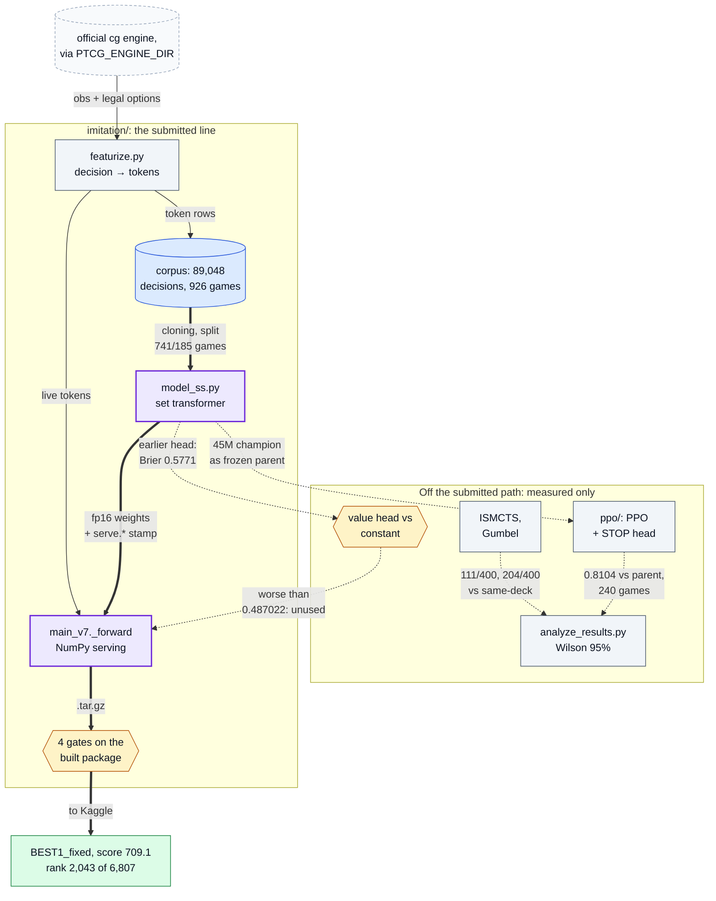
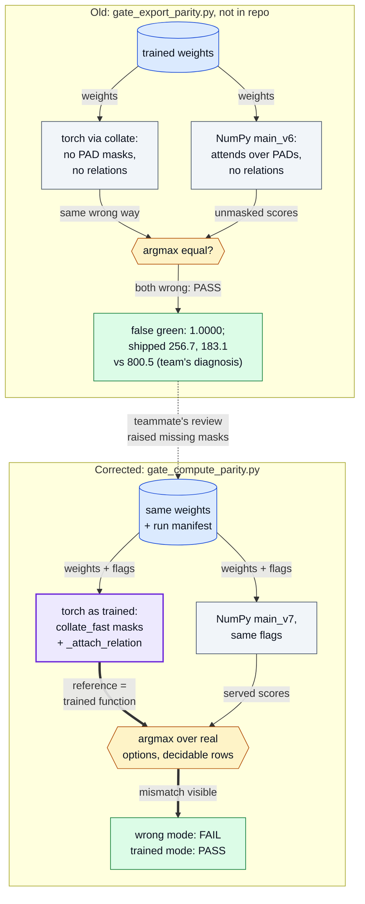

# Pokémon TCG AI Battle: imitation learning, self-play PPO and search

[](https://github.com/oscar-chw/ptcg-ai-battle/actions/workflows/ci.yml) [](https://github.com/oscar-chw/ptcg-ai-battle/actions/workflows/lint.yml)

A team agent for the Kaggle Pokémon TCG AI Battle, a two-player card game with hidden
information: a deck-specialist imitation agent (a set transformer served in hand-written NumPy),
self-play PPO, ISMCTS and Gumbel search baselines, and a suite of gates on the built package. It is
for readers who want to see an ML agent checked from training run to served decision. The
submitted agent, `BEST1_fixed`, finished **rank 2,043 of 6,807 teams on the Simulation
leaderboard, score 709.1** (read on 2026-09-13 and recorded as final).

How the parts connect: the engine feeds the imitation line that was submitted; PPO and search
are branches that were measured and never shipped; the verification suite checks both.



Where in the code: `imitation/`, `ppo/ptcg_ppo/`, `report/analyze_results.py`, `results/`; all diagrams in
[docs/DIAGRAMS.md](docs/DIAGRAMS.md). A component map, not one deployed agent: `BEST1_fixed` was trained on
its own 400-game corpus, its serving file is not recorded, and the corpus figures are from [REPORT.md](report/REPORT.md) §3.

## Why this exists

An agent must play a card game where hands, deck order and prizes are hidden and the set of
legal responses changes with every prompt; a submission is a package run in a sandbox where a
deep-learning framework is not guaranteed, ranked on a ladder of simulated games. The hard part
was knowing what was deployed: **a parity check built the wrong way read green while two
submissions scored 256.7 and 183.1 against the team's 800.5 champion.** So the project's real
subject became *how to know a result is true*.

## Approach

- **Deck-specialist imitation** on strong players' winning games. A single strong demonstrator
  looked better than a five-player corpus, but that comparison is confounded by deck and corpus
  size: an observation, not a measurement ([details](docs/details.md#design-decisions-long-form)).
- **A set transformer over board tokens** with a learned attention bias over typed edges,
  scoring each legal option from its own token, so an illegal action has no logit. Inference is
  hand-written NumPy; torch only trains ([imitation/](imitation/README.md),
  [architecture paper](docs/architecture.pdf)).
- **Four packaging gates** on the built package: featurizer, serving flags, clean-directory
  import, and NumPy-vs-torch choice on identical weights
  ([training to serving, drawn](docs/DIAGRAMS.md#3-training-gates-and-serving)).
- **Evaluation** ([report/](report/README.md)): seat-balanced batteries, Wilson intervals,
  constant-predictor baselines, negative controls. **Search** (ISMCTS, Gumbel): rejected.
- **Self-play PPO with a STOP head** ([ppo/](ppo/README.md)): how many cards to take became a
  policy decision. Never submitted.

The two parity checks, old above corrected: the only edge that differs is how the torch reference is
built, and that decides whether the wrong serving mode can be seen.



Where in the code: [gate_compute_parity.py](imitation/gates/gate_compute_parity.py), `imitation/training/train_ss.py`, [main_v7.py](imitation/serving/main_v7.py).

### Design decisions and trade-offs

- **Imitation, with RL only as a fine-tune.** Imitation is bounded by its teachers (Spidops
  copied a player who won 3 of 48 games); the team's self-play loop had not shown a learning gain.
- **NumPy at inference.** Torch was not guaranteed in the sandbox; the cost is two forwards that
  can drift, which the parity and serve-stamp gates police.
- **No search shipped.** ISMCTS lost, Gumbel showed nothing, and search made repeated runs
  disagree (132/200).
- **A counted serving fallback.** The team's file played a random legal move on any exception,
  silently; this copy plays the lowest legal indices, counts and logs each event, and a test
  guards it. Long form, with sources: [details](docs/details.md#design-decisions-long-form).

## Results

| Result | Value | Evidence |
|---|---|---|
| **Final standing, `BEST1_fixed`** | **rank 2,043 of 6,807 teams; score 709.1** | [final_standing.json](results/final_standing.json) |
| False green at the parity check | passed while two submissions scored 256.7 and 183.1 vs 800.5; the defect's share of that gap is the team's diagnosis, not a measurement | [details](docs/details.md#serving-package-scores-cause-not-recorded) |
| Offline sweep of 32 packages | 20 would raise and play random moves; 9 imported with every card tag zero | [imitation/README.md](imitation/README.md), "Packaging" |
| PPO vs its frozen parent (never submitted) | 0.8104 [0.756, 0.855], 240 games, best of 3 arms; control, parent vs itself, 0.4875 on 200 | [ppo_RESULTS.md](results/ppo_RESULTS.md), [caveats](docs/details.md#full-results) |
| Search vs same-deck baseline | ISMCTS 111/400 = 27.8% [23.6, 32.3], rejected (108/400 cross-deck); Gumbel 204/400, no evidence either way | [analysis_output.txt](results/analysis_output.txt) |
| Value head (an earlier run's) vs a constant | Brier 0.5771, worse than the class-frequency constant's 0.487022 in aggregate; not a paired evaluation | [details](docs/details.md#the-value-head) |
| GPU prototype of a simplified game loop | ~110M environment steps/s on an M2 Max; not rule-complete, code private | [gpu-prototype.md](docs/gpu-prototype.md) |

Intervals are nominal Wilson 95%; nothing here is synthetic. Full table, negative results, per-deck accuracies: [details](docs/details.md).


## Quick start

```bash
bash scripts/demo.sh    # no engine, stdlib python3: recomputes the results table and
                        # fails unless it equals results/analysis_output.txt
bash scripts/check.sh   # every suite that runs without the engine; one it cannot run is SKIPPED
PTCG_PYTHON=/path/to/python-with-numpy-torch-pytest bash scripts/demo.sh   # + model demo
PTCG_ENGINE_DIR=/path/to/sample_submission python3 demo/run_match.py --games 1000
```

The model demo shows, on SYNTHETIC boards, a badly built parity check reading PASS and the
corrected one catching it. A live match needs the official engine, not included ([demo/README.md](demo/README.md)).

## Project structure

```
imitation/   set transformer, featurizer, trainer, NumPy serving, 4 packaging gates, tests
ppo/         STOP head, PPO objective, advantage, opponent pool; 115 tests; design docs
report/      the case study and analyze_results.py (standard library)
results/     every number as a file
figures/     the results figure, PPO count recovery, tests
demo/        live match on your engine; model demo on SYNTHETIC boards
engine/      GPU prototype records: benchmark and parity output
docs/        architecture paper, full results, diagrams
```

Docs: see [docs/README.md](docs/README.md). The schematic [report/architecture.svg](report/architecture.svg)
draws historical branches, not one deployed agent.

## Limits

- **`BEST1_fixed` cannot be reproduced here** (no weights, corpus or final archive), and no
  controlled evaluation of it was recovered ([LIMITATIONS.md](report/LIMITATIONS.md)). The
  battery rows are earlier development branches.
- **The featurizer and trainer need the engine**; tests use a tiny SYNTHETIC model. The PPO
  numbers are records (drivers and the 45M checkpoint not included), and its offline harness did
  not pass its own absolute control ([why PPO was never submitted](docs/details.md#design-decisions-long-form)).
- **Ladder scores drift**: one package scored 800.5 and 851.5 two days apart
  ([BASELINE.md](ppo/docs/BASELINE.md)). Only the final standing is the result.
- **The defect's effect is not measured.** The 800.5 champion was itself served without masks
  or relations (recorded served-vs-trained agreement 0.8736, against 0.8200 for the two failed
  arms; team records, private).
- **Final submission.** `FIXED-312`, which scored 851.5 mid-competition, is a different model
  (160 numeric features, against 269 for `BEST1_fixed`); no head-to-head was recorded, and why
  `BEST1_fixed` was chosen is not in the records (by Oscar's account, no time to resubmit).
- **The GPU prototype** is not parity-tested against the official engine and was never used
  for training.

## What I learned

Lessons from conclusions the records state, confirmed by Oscar on 2026-10-03.

1. **A threshold can be met by a model with no skill.** The constant predictor scores Brier
   0.487022, so a gate of "Brier below 0.5" would admit zero skill; a value-loss gate needs that
   baseline beside it ([REPORT.md](report/REPORT.md) section 4).
2. **A sophisticated method can lose to a plain baseline, and the loss belongs to the
   implementation.** ISMCTS won 111/400 and 108/400 and was rejected "in our evaluated
   implementation, not as a general research direction" ([REPORT.md](report/REPORT.md) section 5).
3. **A go/no-go gate only means something if a miss stops the line.** The older distillation
   line scored 0.376667 against a 0.55 gate, never passed, and was not carried forward
   ([negative_results.md](results/negative_results.md) section 2).
4. **Passing every gate does not show the deployed agent is the trained one.** A parity check
   built the same wrong way as the serving forward could not see that the served function
   differed, and a second build path re-shipped a fixed defect 19 hours later. The packaging
   became four gates run on the built package ([imitation/README.md](imitation/README.md),
   "Packaging").

## Credits and licence

A team entry; teammates are not named. By Oscar's account, he did the engineering, experiments and
analysis, with two recorded exceptions: a teammate's review of the serving path raised the
missing-mask defect behind the false green, and a teammate wrote the deck-scraping and
deck-analysis code. Team write-up: [Kaggle strategy track](https://www.kaggle.com/competitions/pokemon-tcg-ai-battle-challenge-strategy/writeups/from-imitation-to-reliable-play-a-ptcg-agent-stud).
Methods are credited in [REFERENCES.md](report/REFERENCES.md) and [RESEARCH.md](ppo/docs/RESEARCH.md).

Licence, split by authorship: the root MIT [LICENSE](LICENSE) covers Oscar's parts only (`ppo/`,
`demo/`, `scripts/`, `figures/`, `.github/`, `engine/README.md`, `docs/DIAGRAMS.md`,
`docs/gpu-prototype.md`, `docs/README.md` and this README). `imitation/` and `report/` are the
team's and carry their own all-rights-reserved `LICENSE` files until the team agrees a licence;
the rest of `results/` and `docs/` records the team's work and is not MIT either. The engine
(`LicenseRef-PTCG-ABC-Competition-Use-Only`) is read from `PTCG_ENGINE_DIR` and not included.
Pokémon names are third-party trademarks; no artwork, card text or engine files are included.

Implemented with AI coding agents under Oscar's design and review: they implemented this
repository's consolidation, tests, demo and write-ups.
