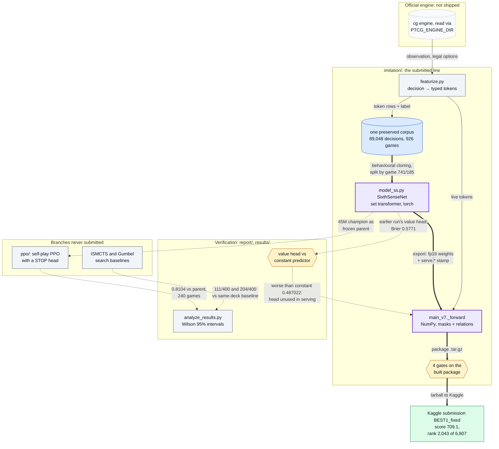
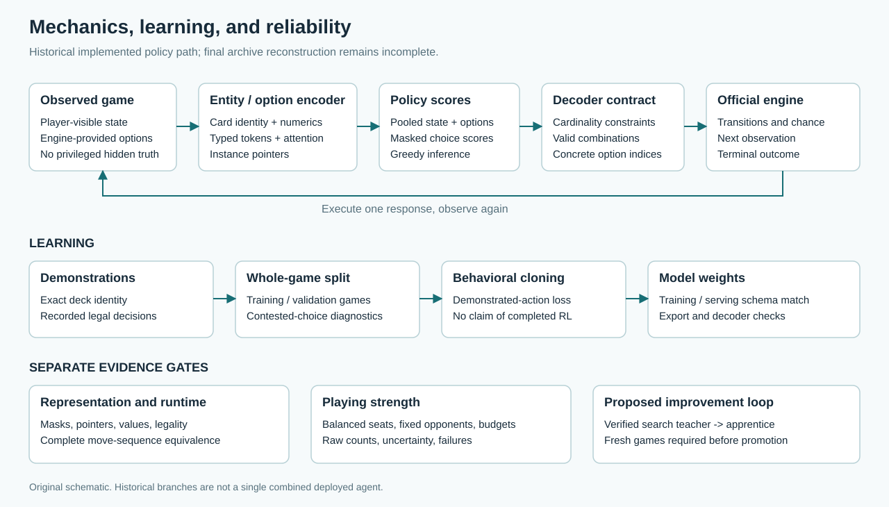
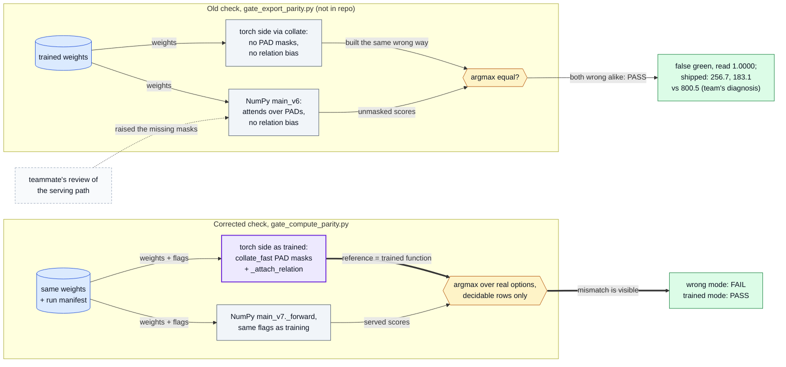
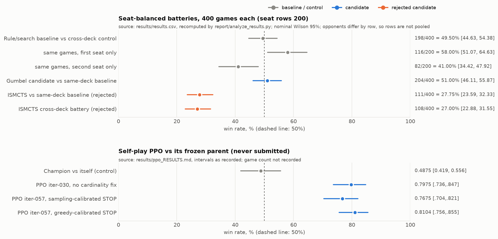
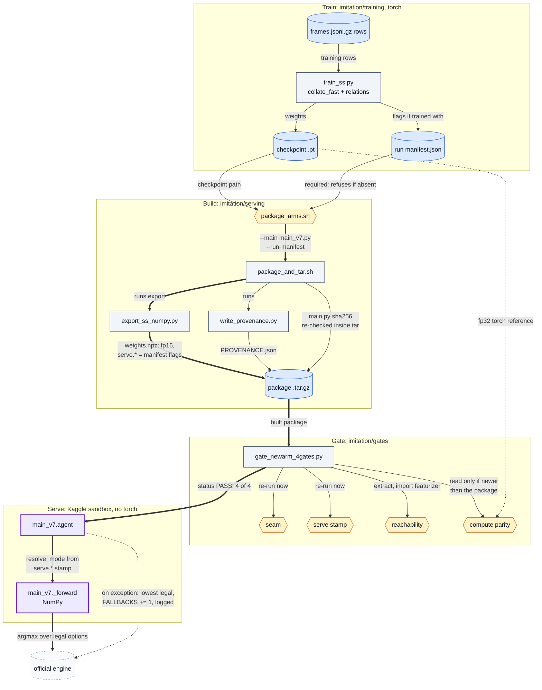

# Pokémon TCG AI Battle: imitation learning, self-play PPO and search

[](https://github.com/oscar-chw/ptcg-ai-battle/actions/workflows/ci.yml) [](https://github.com/oscar-chw/ptcg-ai-battle/actions/workflows/lint.yml)

An agent for the Kaggle Pokémon TCG AI Battle, a two-player card game with hidden information.
Built: a deck-specialist imitation agent (a set transformer over board tokens, served in
hand-written NumPy), self-play PPO with a STOP head, ISMCTS and Gumbel search baselines, a batched
Rust/GPU prototype of a simplified game loop at **~110M environment steps/s on an M2 Max**
([GPU prototype](#gpu-prototype-simplified-game-loop); not rule-complete, code private), and a
verification suite: four gates on the built package, a Wilson interval on every battery and PPO
win rate, and a self-play control for the PPO rows.

How the parts connect: the engine feeds the imitation line that was submitted; PPO and search
are branches that were measured and never shipped; the verification suite checks both.



Where in the code: `imitation/training/` (featurize, model_ss, train_ss),
`imitation/serving/` (export_ss_numpy, main_v7), `imitation/gates/`, `ppo/ptcg_ppo/`,
`report/analyze_results.py`, `results/`. A component map, not one deployed agent:
`BEST1_fixed` was trained on its own 400-game corpus and its serving file is not recorded;
the corpus figures are from [REPORT.md](report/REPORT.md) section 3. All diagrams:
[docs/DIAGRAMS.md](docs/DIAGRAMS.md).

The team's submitted agent, `BEST1_fixed`, finished **rank 2,043 of 6,807 teams on the
Simulation leaderboard, score 709.1**, as read on 2026-09-13 and recorded as final; later
movement was not checked ([results/final_standing.json](results/final_standing.json)). The
team's write-up was submitted to the Kaggle strategy track
([write-up](https://www.kaggle.com/competitions/pokemon-tcg-ai-battle-challenge-strategy/writeups/from-imitation-to-reliable-play-a-ptcg-agent-stud)).

**What it taught:** a check can pass while the deployed agent is broken. A teammate's review of
the serving path found a masking defect that the team's parity check could not see;
[demo/model_demo.py](demo/model_demo.py) reproduces that false green on a SYNTHETIC model, next
to the corrected check catching it ([The problem](#the-problem)).

```bash
bash scripts/demo.sh    # standard-library python3, no engine: results table, headline, PPO game counts
bash scripts/check.sh   # every suite that runs without the engine
PTCG_PYTHON=/path/to/python-with-numpy-torch-pytest bash scripts/demo.sh   # adds the model demo
```



The competition work is the team's; the licence is split by authorship, and no engine code or
data is included ([Limits](#limits)). Implemented with AI coding agents under Oscar's design and review.

## The problem

An agent must play a two-player trading-card game with hidden information (hands, deck
order, prize cards), where the set of legal responses changes with every prompt. The
official simulator supplies each observation and its legal options. A submission is a
package (`main.py`, a deck, weights) run in a sandbox where a deep-learning framework is
not guaranteed, and it is ranked on a ladder of simulated games.

The hard part was knowing what was deployed. **A parity check built the wrong way read green
while two submissions scored 256.7 and 183.1 against the team's 800.5 champion.** A teammate's
review of the serving path raised the missing masks. The serving forward attended over padding
the weights were trained to mask, and the check collated its torch reference the same wrong way,
so both sides agreed ([gate_compute_parity.py](imitation/gates/gate_compute_parity.py),
docstring). How much of the gap that defect caused is the team's diagnosis, not a measurement:
the 800.5 champion was itself served without masks or relations, with recorded served-vs-trained
agreement 0.8736 against 0.8200 for the two failed arms (team records, private). What is certain
is that the defect existed and the check could not see it.

The two parity checks side by side: the only edge that differs is how the torch reference is
built, and that decides whether the wrong serving mode can be seen.



Where in the code: [gate_compute_parity.py](imitation/gates/gate_compute_parity.py) (docstring
names the old gate), `imitation/training/train_ss.py` (`collate`, `collate_fast`,
`_attach_relation`), [main_v7.py](imitation/serving/main_v7.py); `main_v6` is not in this
repository. [demo/model_demo.py](demo/model_demo.py) reproduces both rows on a SYNTHETIC model.

Besides that false green, a second build path re-shipped a fixed defect 19 hours later (260.9 and 156.9 against 800.5),
and an offline sweep of 32 packages found 20 whose import would raise in the Kaggle
extraction layout, so they would play random moves, and 9 more that imported with every card
tag silently zero ([imitation/README.md](imitation/README.md), "Packaging"). So the project's
real subject became *how to know a result is true*.

## Approach (methods and algorithms)

- **Deck-specialist imitation** on strong players' winning games. A single strong
  demonstrator looked better than a five-player corpus, but that comparison is confounded by
  deck and corpus size: an observation, not a measurement ([docs/details.md](docs/details.md)).
- **A set transformer over board tokens** with a learned attention bias over typed edges,
  scoring each legal option from its own token, so an illegal action has no logit. Inference
  is hand-written NumPy; torch only trains ([imitation/](imitation/README.md),
  [docs/architecture.pdf](docs/architecture.pdf)).
- **Four packaging gates** on the built package: featurizer, serving flags, clean-directory
  import, and NumPy-vs-torch choice on identical weights.
- **Evaluation** ([report/](report/README.md)): seat-balanced batteries, Wilson intervals,
  constant-predictor baselines, negative controls. **Search** (ISMCTS, Gumbel): rejected.
- **Self-play PPO with a STOP head** ([ppo/](ppo/README.md)): how many cards to take became a
  policy decision. Never submitted.

Methods are credited in [report/REFERENCES.md](report/REFERENCES.md) and
[ppo/docs/RESEARCH.md](ppo/docs/RESEARCH.md).

**Who did what.** This was a team entry; teammates are not named. By Oscar's account, he did
the project's engineering, experiments and analysis, with two recorded exceptions: a
teammate's review of the serving path raised the missing-mask defect behind the false green
(see [The problem](#the-problem)), and a teammate wrote the deck-scraping and deck-analysis code. The folders recorded
as team work (`imitation/`, `report/`) keep "all rights reserved" until the team agrees to a licence. AI coding
agents implemented this repository's consolidation, tests, demo and write-ups.

## Results (real numbers with their source; synthetic clearly labelled)



Rendered by [figures/plot_results.py](figures/plot_results.py) from committed CSVs;
`figures/tests` checks every plotted number against its source. No result here is
synthetic. Intervals are nominal Wilson 95%.

| Result | Value | Source |
|---|---|---|
| **Final standing, `BEST1_fixed`** | **rank 2,043 of 6,807 teams; score 709.1** (read 2026-09-13) | [final_standing.json](results/final_standing.json) |
| Value head vs a zero-skill constant | value head Brier 0.5771 (an earlier run's head, `ss-tf-ptr-001`, not the submitted agent's); a class-frequency constant scores 0.487022 on 17,392 validation rows with no draws, so the head did worse than no skill **in aggregate** (same corpus split, not a paired evaluation; the team had compared it with a 0.6667 three-class reference; a later head was useful late in games, see details) | [analysis_output.txt](results/analysis_output.txt), [details](docs/details.md#the-value-head) |
| ISMCTS, rejected | 111/400 = 27.75% [23.59, 32.33] vs same-deck baseline; 108/400 cross-deck | [analysis_output.txt](results/analysis_output.txt) |
| PPO vs frozen parent (never submitted) | 0.8104 [0.756, 0.855] on 240 games; control, parent vs itself, 0.4875 [0.419, 0.556] on 200 | [ppo_RESULTS.md](results/ppo_RESULTS.md), [ppo_counts.py](figures/ppo_counts.py) |

PPO caveats: the game counts were not recorded; they are the only ones the intervals allow
(194.5/240, 97.5/200), and the half-points mean draws scored 0.5 there, not 0 as in the
battery rows. 0.8104 is the best of three arms on the same opponent; Bonferroni over 3 gives
[0.743, 0.863]. Against an opponent never trained against: PPO 0.7167 [0.663, 0.765],
champion 0.5333 [0.409, 0.654] on only about 60 games (why the samples differ is not
recorded).

[docs/details.md](docs/details.md) has the full table, the negative results, per-deck
accuracies with the one recorded baseline, and one checkpoint that scored 851.5, 305.9 and
133.1 in three serving packages, **cause not recorded**.

## How to run (under 5 minutes)

```bash
bash scripts/demo.sh     # no engine, standard-library python3; under a second when observed
bash scripts/check.sh    # no engine; observed about 1 s without torch, about 20 s with it
```

`demo.sh` fails unless the recomputed table equals
[results/analysis_output.txt](results/analysis_output.txt). With `PTCG_PYTHON` set it also runs
[demo/model_demo.py](demo/model_demo.py): the NumPy serving forward scores SYNTHETIC boards
beside torch, a badly built parity check reads a false PASS, and the correct one catches it. `check.sh` prints suites it
cannot run as SKIPPED, never passed. [CI](.github/workflows/ci.yml) is configured to run both,
installing numpy and CPU torch on the runner; its current status is the CI badge at the top of this README. Timings are single local observations.

A live match needs the official engine, licensed for competition use only and not included
([demo/README.md](demo/README.md); Python 3.10+):

```bash
PTCG_ENGINE_DIR=/path/to/sample_submission python3 demo/run_match.py --games 1000
```

## Architecture

```
imitation/   set transformer, featurizer, trainer, NumPy serving, 4 packaging gates, tests
ppo/         STOP head, PPO objective, advantage, opponent pool; 115 tests; design docs
report/      the case study and analyze_results.py (standard library)
results/     every number as a file;  figures/  the figure, PPO count recovery, tests
demo/        live match on your engine; model demo on SYNTHETIC boards
docs/        architecture paper, details.md;  engine/  GPU prototype: numbers, parity output
```

The image at the top ([architecture.svg](report/architecture.svg)) is a schematic of historical branches, not one deployed agent: the
play loop (observation, typed-token encoder, masked option scores, decoder contract, official
engine), the learning path (demonstrations, whole-game split, behavioural cloning, weights,
schema match, export and decoder checks), and the separate evidence gates for runtime and
playing strength.

From training run to served decision: the run's manifest is required to build, the package is
gated as built, and the sandbox serves the mode the run trained with.



Where in the code: `imitation/training/train_ss.py`, `imitation/serving/` (package_arms.sh,
package_and_tar.sh, export_ss_numpy.py, write_provenance.py, main_v7.py), `imitation/gates/`
(gate_newarm_4gates.py and the four gates). The tests that each gate fires on a planted defect
are in `imitation/tests_torch/`.

### Design decisions and trade-offs

- **Imitation, with RL only as a fine-tune.** Imitation is bounded by its teachers (Spidops
  copied a player who won 3 of 48 games, 6.2%); the team's self-play loop had not been tested
  for a learning gain.
- **NumPy at inference.** Torch was not guaranteed in the sandbox; the cost is two forwards
  that can drift, which the parity and serve-stamp gates police.
- **No search shipped.** ISMCTS lost, Gumbel showed nothing, the value head scored worse
  than a constant predictor in aggregate, and search made repeated runs disagree (132/200).
- **PPO never submitted.** No reason is recorded; the opponent pool was not wired in and the
  offline harness failed its own control.
- **A counted serving fallback.** The team's file played a random legal move on any exception,
  silently; this copy plays the lowest legal indices, counts and logs each event, and a test
  guards it ([imitation/README.md](imitation/README.md)).

Sources: [docs/details.md](docs/details.md).

### GPU prototype (simplified game loop)

A batched Rust/GPU simulator of a **simplified slice** of the game loop (setup, draw, energy,
attacks with weakness and resistance, knock-outs, prizes, retreat, bench, three win conditions,
legal-action mask, observation): **~110M environment steps/s on an Apple M2 Max** (Metal, batch
262,144). Originally 110.14M, 4.8x the same slice on 12 CPU cores (22.82M); re-run on
2026-10-03, 109.47M, 4.4x (24.69M) ([raw output](engine/results/gpubench-2026-10-03.txt)).
One parity test compares GPU output with the prototype's own Rust CPU reference (4,096 seeded
games over 48 steps, per [engine/README.md](engine/README.md)); a second runs the CUDA source
as host C++ against the same reference, and a third checks the simulation progresses. All 3
pass; the committed output shows test names only
([output](engine/results/parity-2026-10-03.txt)). Not rule-complete, not parity-tested
against the official engine, never used for training; the code is a derivative of the
competition-use-only engine and stays private. Details and how it is reproduced:
[engine/README.md](engine/README.md); its three-backend layout and the parity tests are drawn
in [docs/DIAGRAMS.md](docs/DIAGRAMS.md#4-gpu-prototype-and-its-parity-tests).

## Limits

- **`BEST1_fixed` cannot be reproduced here** (no weights, corpus or final archive), and no
  controlled evaluation of it was recovered ([report/LIMITATIONS.md](report/LIMITATIONS.md)).
  The battery rows are earlier development branches.
- **The featurizer and trainer need the engine**; tests use a tiny SYNTHETIC model. The PPO
  numbers are records: their drivers and the 45M checkpoint are not included.
- **Ladder scores drift**: one package scored 800.5 and 851.5 two days apart
  ([ppo/docs/BASELINE.md](ppo/docs/BASELINE.md)). Only the final standing is the result.
- **Final submission.** `BEST1_fixed`, a Mega Lucario specialist with 269 numeric features
  ([report/REPORT.md](report/REPORT.md) section 1), was the final submission. `FIXED-312`,
  which scored 851.5 on the ladder mid-competition, is a different model that takes 160
  numeric features ([ppo/docs/BASELINE.md](ppo/docs/BASELINE.md) section 1). No head-to-head
  between them was recorded, and why `BEST1_fixed` was chosen is not in the records (by
  Oscar's account, there was no time to resubmit `FIXED-312`).
- **Pokémon names are third-party trademarks**; no artwork, card text or engine files.
- **Licence, split by authorship.** The root MIT licence ([LICENSE](LICENSE)) covers Oscar's
  parts only: `ppo/`, `demo/`, `scripts/`, `figures/`, `.github/`, `engine/README.md`, `docs/DIAGRAMS.md` and this
  README. `imitation/` and `report/` are the team's and carry their own all-rights-reserved
  `LICENSE` files; `results/` and `docs/` record the team's work and are not MIT either. The
  engine (`LicenseRef-PTCG-ABC-Competition-Use-Only`) is read from `PTCG_ENGINE_DIR`.

## What I learned

Lessons from conclusions the records state, confirmed by Oscar on 2026-10-03.

1. **A threshold can be met by a model with no skill.** The constant predictor scores Brier
   0.487022, so a gate of "Brier below 0.5" would admit zero skill; a value-loss gate needs
   that baseline beside it ([report/REPORT.md](report/REPORT.md) section 4).

2. **A sophisticated method can lose to a plain baseline, and the loss belongs to the
   implementation.** ISMCTS won 111/400 and 108/400 and was rejected "in our evaluated
   implementation, not as a general research direction"
   ([report/REPORT.md](report/REPORT.md) section 5).

3. **A go/no-go gate only means something if a miss stops the line.** The older distillation
   line scored 0.376667 against a 0.55 gate, never passed, and was not carried forward
   ([results/negative_results.md](results/negative_results.md) section 2).

4. **Passing every gate does not show the deployed agent is the trained one.** A parity check
   built the same wrong way as the serving forward could not see that the served function
   differed from the trained one, and a second build path re-shipped a fixed defect. The packaging became four gates run on the built package
   ([imitation/README.md](imitation/README.md), "Packaging";
   [gate_compute_parity.py](imitation/gates/gate_compute_parity.py)).
