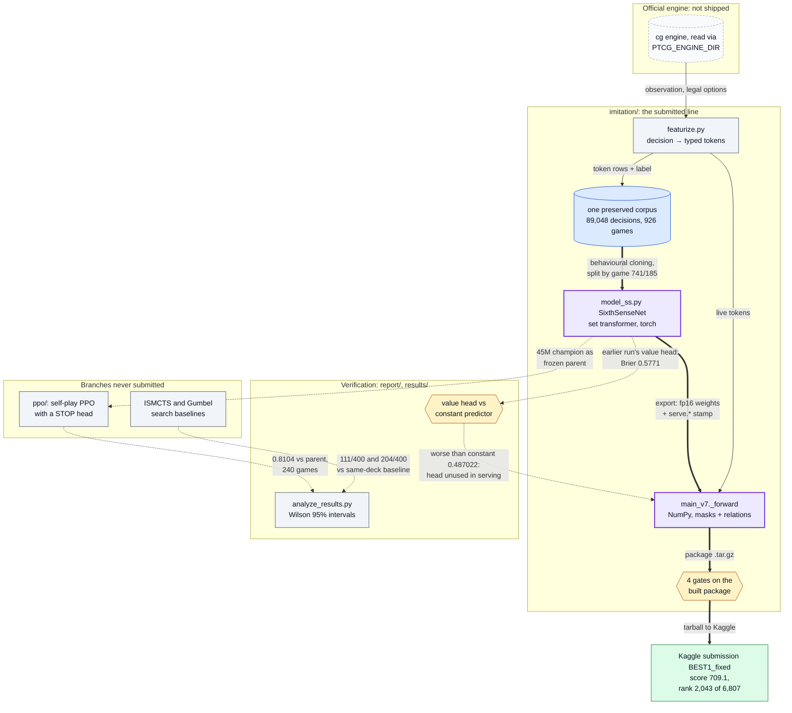
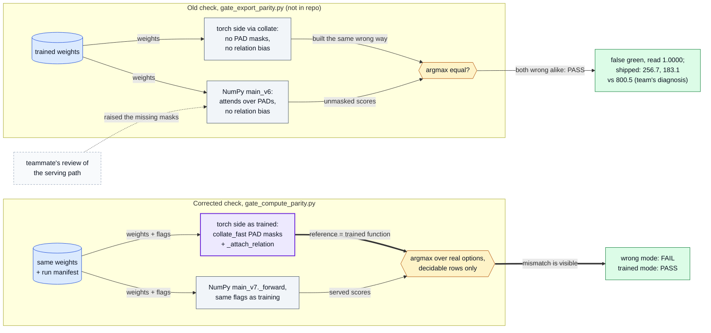
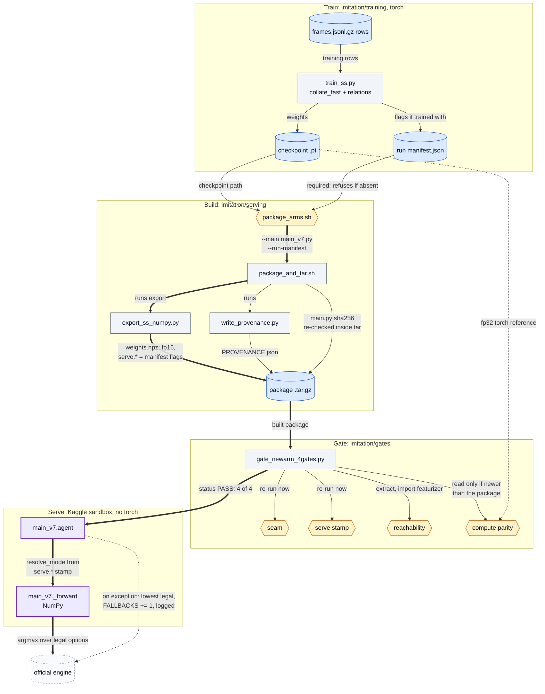
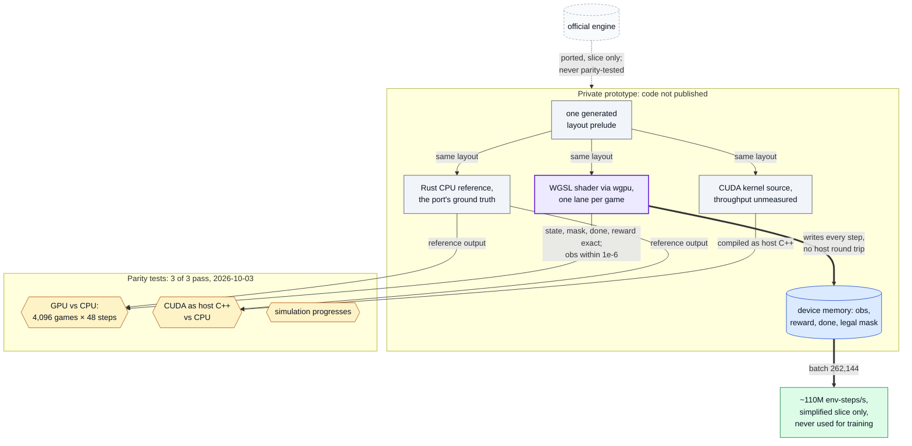

# Diagrams

Each diagram draws a mechanism this repository documents; every node is a file, function or
documented step, and every number is sourced in the README or the file named under it. The
README embeds diagrams 1 to 3.

*If a diagram and the code disagree, the code wins.*

1. [System overview](#1-system-overview)
2. [The false-green parity check, side by side](#2-the-false-green-parity-check-side-by-side)
3. [Training, gates and serving](#3-training-gates-and-serving)
4. [GPU prototype and its parity tests](#4-gpu-prototype-and-its-parity-tests)

## 1. System overview

How the parts connect: the engine feeds the imitation line that was submitted; PPO and search
are branches that were measured and never shipped; the verification suite checks both.

Where in the code: `imitation/training/` (featurize, model_ss, train_ss),
`imitation/serving/` (export_ss_numpy, main_v7), `imitation/gates/`, `ppo/ptcg_ppo/`,
`report/analyze_results.py`, `results/`. A component map, not one deployed agent:
`BEST1_fixed` was trained on its own 400-game corpus and its serving file is not recorded;
the corpus figures are from [REPORT.md](../report/REPORT.md) section 3.

## 2. The false-green parity check, side by side

The two parity checks side by side: the only edge that differs is how the torch reference is
built, and that decides whether the wrong serving mode can be seen. A teammate's review of the
serving path raised the missing masks.

Where in the code: [gate_compute_parity.py](../imitation/gates/gate_compute_parity.py)
(docstring names the old gate), `imitation/training/train_ss.py` (`collate`, `collate_fast`,
`_attach_relation`), [main_v7.py](../imitation/serving/main_v7.py); `main_v6` is not in this
repository. [demo/model_demo.py](../demo/model_demo.py) reproduces both rows on a SYNTHETIC
model.

## 3. Training, gates and serving

From training run to served decision: the run's manifest is required to build, the package is
gated as built, and the sandbox serves the mode the run trained with.

Where in the code: `imitation/training/train_ss.py`, `imitation/serving/` (package_arms.sh,
package_and_tar.sh, export_ss_numpy.py, write_provenance.py, main_v7.py), `imitation/gates/`
(gate_newarm_4gates.py and the four gates); planted-defect tests in `imitation/tests_torch/`.

## 4. GPU prototype and its parity tests

The prototype's three backends share one layout; the GPU path is checked against the port's own
CPU reference, and nothing connects it to the official engine except the port itself.

Where in the code: not published (`crates/ptcg-gpu` in the private prototype); the records are
[engine/README.md](../engine/README.md) and
[engine/results/](../engine/results/gpubench-2026-10-03.txt).
