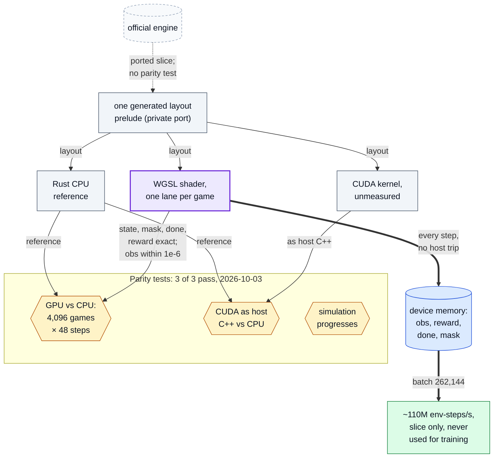

# GPU engine prototype: numbers and design only

A separate local project built **a batched Rust/GPU prototype of a simplified game-loop
slice** of the competition's game, to see how many environment steps per second a
self-play learner could be fed. It was **verified against its own CPU reference; it is not
rule-complete; it was not parity-tested against the official engine; and it was never used
for training.** No result elsewhere in this repository depends on it.

**No code from that prototype is in this repository.** The official engine is licensed for
competition use only (`LicenseRef-PTCG-ABC-Competition-Use-Only`), and a port is a
derivative work of it, so the port stays local. Its notes (`crates/ptcg-gpu/GPU_NOTES.md`,
`crates/ptcg-core/PORT_NOTES.md`) are not published either, so nothing below can be
reproduced from this repository alone. The raw output of the 2026-10-03 re-run is committed
in [results/](results/).

## Reproducing (with access to the private prototype)

On an Apple-silicon Mac with the prototype checked out, from `crates/ptcg-gpu`:

```bash
cargo run --release --bin gpubench          # throughput sweep; prints the table below
cargo test --release --test parity          # GPU vs CPU reference: 4,096 games x 48 steps
```

Re-run on 2026-10-03 on the same M2 Max: 109.47M env-steps/s at batch 262,144, 4.4x the
12-core CPU reference's 24.69M (110.14M and 4.8x originally recorded), and 3/3 parity tests
passing: one compares GPU output with the CPU reference, one runs the CUDA source as host C++
against it, and one checks the simulation progresses
([gpubench-2026-10-03.txt](results/gpubench-2026-10-03.txt),
[parity-2026-10-03.txt](results/parity-2026-10-03.txt); the parity output lists test names
only).

## What the slice is

The measured slice implements setup and shuffle, drawing, energy attachment, attacks with
weakness and resistance, knock-outs, prize taking, promotion, retreat, benching, three win
conditions, the legal-action mask and the observation. The port's own notes call that
"5-10% of the opcode surface". Separately, of the card database's effect instructions,
29.6% are guards that need no code and the port's VM has bodies for another 60.7%; 44 live
opcodes are still missing. The full game loop, main-phase option generation and the
selection continuations are recorded as "not started". So the prototype cannot play a real
game, and the throughput below is for the slice only.

## What was measured, and on what

Apple M2 Max (30-core integrated GPU, unified memory), Metal backend, one dispatch per
environment step. "Environment step" means one agent decision for every game in the batch,
in the slice.

| batch (games) | env-steps/s | games/s |
|---:|---:|---:|
| 4,096 | 10.32M | 60.6k |
| 32,768 | 56.68M | 332.7k |
| **262,144** | **110.14M** | **572.2k** |
| 1,048,576 | 66.32M | 345.0k |

Peak for the slice: 110.14M env-steps/s at batch 262,144. Small batches are
dispatch-bound; the largest lost 40% of the peak when its state no longer fit one storage
binding and contended with the OS for unified memory. On the same machine the port's own
CPU reference ran the slice at 3.19M env-steps/s on one core and 22.82M on 12 cores. The
raw benchmark output stays in the private port repository.

**Verification is internal only.** The GPU path was checked against the port's own Rust CPU
reference over 4,096 seeded games of 48 steps: state, legal mask, done flag and reward
exact, observation within 1e-6. That shows the GPU and CPU versions of the *port* agree; it
says nothing about agreement with the official engine, which was never compared. Of the
213 Rust tests that passed when re-run on 2026-10-03, 18 exercise a wrapper around the
official engine (the port's oracle) and the rest test the port's own components; none
compares the port's rules with the official engine's.

## What the numbers do not mean

- **Not the real game.** 110.14M is not a throughput for the official engine or for full
  rules; the notes' estimate of the full-rules cost is a projection and is not repeated here.
- **Not an engine-fidelity result.** No parity test against the official engine exists.
- **Not used.** No model in this repository was trained on it.
- **No CUDA number.** The CUDA kernel compiled as host C++ and matched the CPU reference,
  but no NVIDIA GPU was available, so CUDA throughput is unmeasured.
- **One laptop-class GPU**, and one lane per game, so rule-path divergence across a warp,
  which the slice barely exercises, is not priced in.

## Design

- **Three backends over one layout**: a Rust CPU implementation as the port's ground truth,
  a WGSL/wgpu shader on Metal, and a CUDA kernel as the intended target, assembled from one
  generated layout prelude so a layout change cannot reach one backend and miss another.
- **Fixed-size, allocation-free state**, a hot part touched every step and a cold sparse
  side table: 5,156 bytes per game instead of 51,460.
- **Device-resident loop**: observation, reward, done flag and legal-action mask are written
  into device memory, so a learner could read them without a host round trip (6.2x faster
  than copying them each step: 86.08M against 13.91M env-steps/s at batch 65,536).

The three backends, the device-resident loop and the parity tests, as the notes above
describe them (the code itself is private):



Where in the code: not published (`crates/ptcg-gpu` in the private prototype); the records
are this file and [results/](results/).
